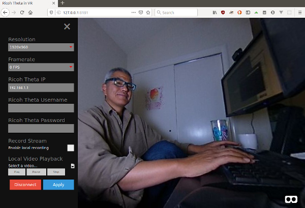
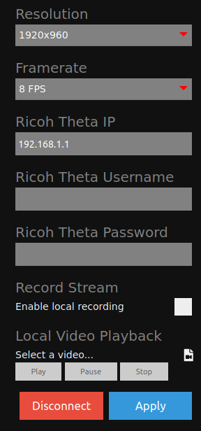

# Amelia Viewer by Jake Kenin


This is a fork of Jake Kenin's code to display LiveView video from the RICOH THETA V.  
See Jake's original [README](docs/README.original.md).



Binaries are available for Windows and Linux in the 
[releases](https://github.com/codetricity/amelia_viewer/releases) section.


I've added Electron Forge to be able to build binaries
for different platforms.



There is an active discussion on this forum [here](https://community.theta360.guide/t/successful-theta-v-stream-from-drone-to-vr-headset-0-25-miles-away/4437/). 

## RICOH THETA MotionJPEG Streaming

This is a low-framerate, low-latency method of streaming video over wifi.

Live View Specifications (Only still image capture mode) (RICOH THETA S or above)
Equirectangular data in MotionJPEG format is output.

Image size: 640x320, 1024x512*, 1920x960*

* RICOH THETA V or later


This project uses the `camera.getLivePreview` API for the RICOH THETA V.  It should
work with most RICOH THETA cameras.  The API is here reference is here:

https://api.ricoh/docs/theta-web-api-v2.1/commands/camera.get_live_preview/

The Amelia Viewer code references this code for MotionJPEG readable stream.

https://github.com/aruntj/mjpeg-readable-stream/blob/master/index.html

You can see the working code with the THETA V here:

https://github.com/codetricity/amelia_viewer/blob/137d2537a6f5408333eedc5ea15dc7298348110e/assets/js/ricoh_api.js#L218

## Other Variants of MotionJPEG Streaming Code

There are additional examples of MotionJPEG streaming at this link.

http://theta360developers.github.io/community-document/live-streaming.html#_untethered_wifi_streaming

```
...(http)
0xFF 0xD8      --|
[jpeg data]      |--1 frame of MotionJPEG
0xFF 0xD9      --|
...(http)
0xFF 0xD8      --|
[jpeg data]      |--1 frame of MotionJPEG
0xFF 0xD9      --|
...(http)
```

There is another example of parsing an mjpeg stream from an IP camera here:

https://stackoverflow.com/questions/21702477/how-to-parse-mjpeg-http-stream-from-ip-camera


## Video Showing Demo and Installation from Source Code

See this video for installation and usage demo.

https://www.youtube.com/watch?v=On8qS_6eM7Y

## Wi-Fi Connection Options

You can connect to the THETA in access point mode or client mode.  If your THETA connects
to your home or office router, you must use digest authentication.

See this link for RICOH THETA digest mode information.

https://community.theta360.guide/t/tip-developing-theta-client-mode-applications/2450

There are many examples of how to connect and authenticate.